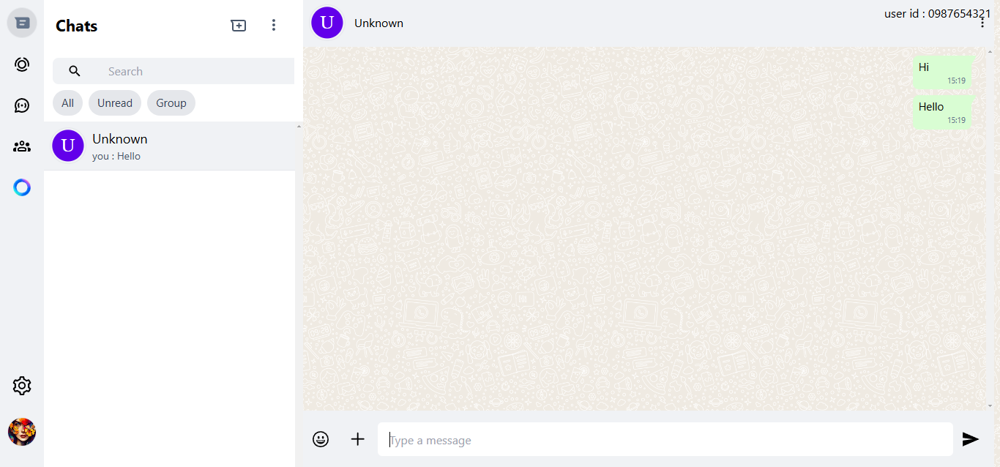

# WhatsApp Clone - Anonymous Chat

This is a lightweight WhatsApp clone built using Node.js and React, designed for anonymous real-time chat. The app does not use any database or store any user credentials, ensuring a privacy-focused chatting experience. It's mobile responsive, providing seamless chat across devices.




## Features

- Real-time anonymous messaging without storing any personal data.

- Node.js backend that listens for messages on port 5000.
- React frontend for a modern, responsive chat UI.

- No database – no storage of messages or user information.

- Mobile responsive – use the chat on your phone or tablet with ease.


## Demo

https://clone-web-whatsapp.vercel.app/

## Local Setup
To run the project locally on your machine, follow these steps:

#### Requirements
Node.js (v14 or higher)

npm (Node package manager)

#### Steps
1. Clone the repository:
    ```bash
    git clone https://github.com/Ctmax-ui/api-for-whatsapp-clone
    cd api-for-whatsapp-clone
    ```

2. Start the Node.js server: 
In the root of the project, run the following command:

    ```bash
    npm install
    npm server.js
    ```

3. Clone the React frontend:

    ```bash
    git clone https://github.com/Ctmax-ui/whatsapp-web-clone
    cd whatsapp-web-clone
    ```

4. Download and run the backend from here [Localhost Backend api](https://github.com/Ctmax-ui/api-for-whatsapp-clone)
    ```bash
    git clone https://github.com/Ctmax-ui/api-for-whatsapp-clone.git
    cd api-for-whatsapp-clone
    npm start
    ```

5. Run the React server:

    ```bash
    npm install
    npm run dev
    ```

## Note:

Local chat limitation: You cannot chat between devices on different networks when running the project locally. This is due to the local server setup. If you want to chat across different networks or devices, please use the live demo link above.


## Contributing

If you'd like to contribute to this project, feel free to fork the repository and submit pull requests.
